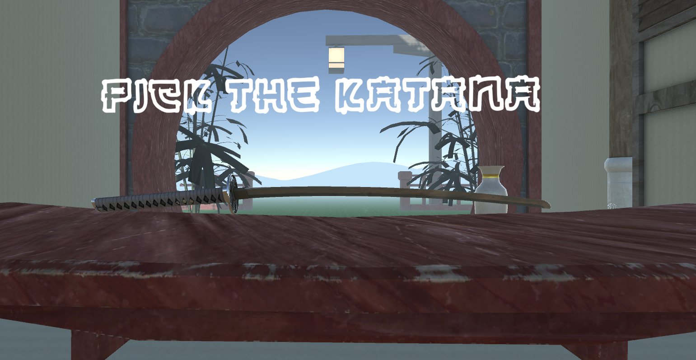

# Coin War - Online Multiplayer Cardgame

<!---Esses são exemplos. Veja https://shields.io para outras pessoas ou para personalizar este conjunto de escudos. Você pode querer incluir dependências, status do projeto e informações de licença aqui--->

> This is a samurai game made in VR, in which you need to cut ice cubes in order to make Kakigori! it gets more difficult as you cut ices!

## 💻 Requirements

Before starting, make sure you've met the following requirements:
* Unity 2020,1,6f1
* This game uses XR interaction toolkit.

[⬆Back to the top](#SamuraiVR) 
